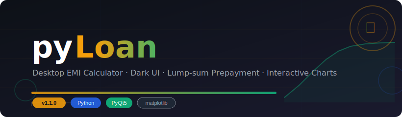
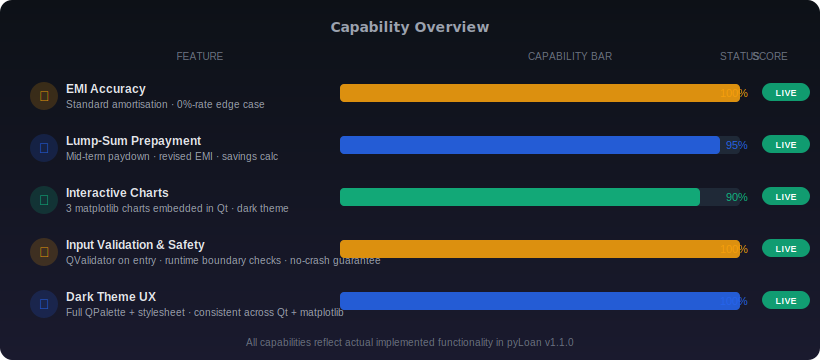
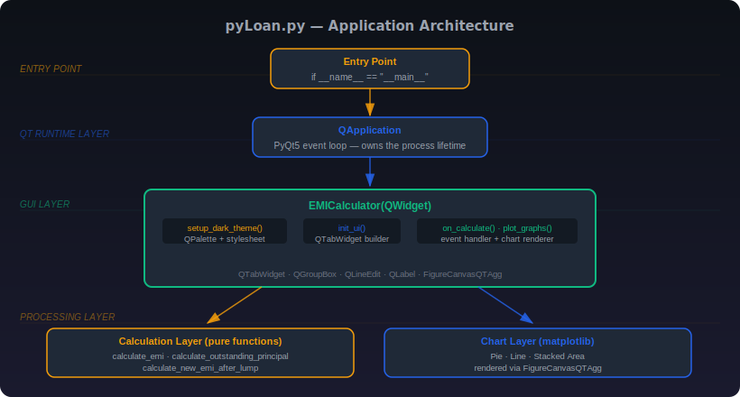
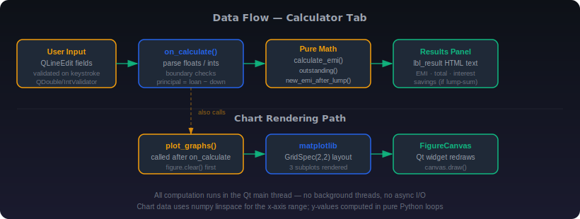
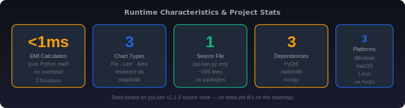

<div align="center">



</div>

**The loan calculator that finally tells you the truth about how much of your EMI is just interest. (Hint: it's a lot.)**

[Features](#-features) • [Installation](#-installation) • [Usage](#-usage) • [Architecture](#-architecture) • [Roadmap](#-roadmap) • [License](#-license)

---

*I built this because every online EMI calculator either drowns you in ads, asks for your phone number, or rounds things in ways that conveniently benefit the bank. pyLoan is a local Python app: you type numbers, you get math, you close the window, and nobody learns anything about your mortgage.*

**pyLoan** is a single-file desktop Loan EMI calculator built with Python 3, PyQt5, and matplotlib. You give it a loan amount, interest rate, and tenure; it gives you the monthly EMI, total interest paid, and three embedded charts that make the pain visual. The lump-sum prepayment simulator shows exactly how much a one-time payment at year N will reduce your future EMIs and total outgo — which is the number banks really don't want you thinking about.

---

<div align="center">

[](https://www.python.org/)
[](https://riverbankcomputing.com/software/pyqt/)
[](https://matplotlib.org/)
[](https://numpy.org/)
[](LICENSE)
[](CHANGELOG.md)
[]()

</div>

---

## 🧩 System Overview

pyLoan is a single-file desktop application. No server. No database. No cloud. No subscription. Just Python, Qt, and the standard amortisation formula. The file is `pyLoan.py` and it contains everything: the math, the UI, and the chart rendering.

```
pyLoan/
├── 📄 pyLoan.py          ← The whole application. ~389 lines.
├── 📄 README.md
├── 📄 LICENSE
├── 📄 CONTRIBUTING.md
├── 📄 CHANGELOG.md
├── 📄 SECURITY.md
├── 📁 assets/            ← SVG diagrams and demo media
│   ├── hero-banner.svg
│   ├── architecture.svg
│   ├── data-flow.svg
│   ├── capabilities.svg
│   └── stats.svg
└── 📁 wiki/              ← Extended documentation
    ├── Home.md
    ├── Architecture.md
    ├── Installation.md
    ├── Usage.md
    ├── Privacy.md
    ├── Troubleshooting.md
    └── Roadmap.md
```

Three pure functions handle all the math at module level. A single `EMICalculator(QWidget)` class owns the entire UI. `QApplication` runs the event loop. That's the whole architecture — see the [Architecture](#-architecture) section for the full diagram.

---

## ✨ Features

| Feature | What it actually does |
|---|---|
| 🌑 **Dark Theme** | Full `QPalette` override + Qt stylesheet — consistent dark mode across every widget including the embedded matplotlib charts |
| 🧮 **EMI Calculation** | Standard amortisation formula `P·r·(1+r)^n / ((1+r)^n − 1)` with a specific 0%-rate branch that returns `P/n` instead of dividing by zero |
| 💰 **Lump-Sum Prepayment** | Computes outstanding balance at year N, subtracts the prepayment, recalculates EMI on the remainder, and shows total savings vs. the baseline |
| 📊 **3 Embedded Charts** | Payment breakdown pie · outstanding-principal decay line chart · stacked area chart of principal-vs-interest components per month |
| ✅ **Input Validation** | `QDoubleValidator`/`QIntValidator` rejects non-numeric keystrokes; `on_calculate()` also checks for negative rates, zero tenure, and principal ≤ 0 |
| 🛡️ **Edge-Case Handling** | 0% interest rate, zero-tenure, and lump-sum ≥ outstanding principal all have explicit branches — no `ZeroDivisionError`, no `nan` in charts |

---

## 📈 Capability Visualization

<div align="center">



</div>

---

## 🏗️ Architecture

<div align="center">



</div>

Despite being a single file, pyLoan has clean separation across three layers. The **Calculation Layer** consists of three pure module-level functions that take numbers and return numbers — no Qt imports, no side effects, testable in isolation. The **GUI Layer** is the `EMICalculator(QWidget)` class, which builds the widget tree in `init_ui()`, handles the button click in `on_calculate()`, and renders charts in `plot_graphs()`. The **Entry Point** is five lines of standard Qt boilerplate at the bottom of the file.

The single-file design is intentional. There's no install step, no package structure to navigate, and no import graph to untangle. The tradeoff is that the file is doing several things, but each concern is localized to a clearly named method. The pure-function math layer means the GUI is never doing arithmetic and the arithmetic is never touching a widget.

---

## 🔄 Data Flow

<div align="center">



</div>

The primary data path through the application:

```
QLineEdit fields (validated on keystroke)
    ↓
on_calculate() — parse float/int, check boundaries, compute principal
    ↓                                    ↓
calculate_emi()                     plot_graphs()
calculate_outstanding_principal()       ↓
calculate_new_emi_after_lump()      matplotlib figure.clear() + redraw
    ↓                                    ↓
lbl_result.setText(HTML)           FigureCanvasQTAgg.draw()
```

Everything runs in the Qt main thread. There is no background threading, no async I/O, and no signal queue beyond what Qt provides natively. Chart x-axis ranges are `numpy.arange(1, total_months + 1)`; y-values are computed in plain Python loops calling the calculation functions.

---

## ⚙️ Installation

**Prerequisites:** Python 3.8 or newer on Windows, macOS, or Linux. That's it.

1. **Clone the repository**

   ```bash
   git clone https://github.com/Kaelith69/pyLoan.git
   cd pyLoan
   ```

2. **Create and activate a virtual environment** (strongly recommended — keeps your system Python clean)

   ```bash
   python -m venv .venv
   source .venv/bin/activate      # macOS / Linux
   .venv\Scripts\activate         # Windows
   ```

3. **Install the three dependencies**

   ```bash
   pip install PyQt5 matplotlib numpy
   ```

   - **PyQt5** — the GUI framework. Provides the window, input fields, buttons, and tab widget.
   - **matplotlib** — renders the three embedded charts. Without it the Graphs tab is empty.
   - **numpy** — used for `np.arange` to generate chart x-axis ranges without float-stepping artifacts.

| Platform | Notes |
|---|---|
| Windows | Works out of the box after `pip install`. |
| macOS | Works out of the box. On Apple Silicon, use a native Python 3.11+ build for best performance. |
| Linux | If `PyQt5` fails to install via pip, try `sudo apt-get install python3-pyqt5` (Debian/Ubuntu) as a fallback — the system package bundles the Qt runtime. |

> 💡 **Pro tip:** If you see a blank Graphs tab after clicking Calculate, your matplotlib backend may not be `Qt5Agg`. The app sets `plt.style.use('dark_background')` at startup but doesn't force the backend — if you have multiple backends installed, set `MPLBACKEND=Qt5Agg` before running.

---

## 🚀 Usage

1. Run the app:

   ```bash
   python pyLoan.py
   ```

2. Fill in **Loan Parameters**:

   ```
   ┌──────────────────────────────────────────┐
   │ Downpayment:   200000                    │
   │ Total Loan:    2000000                   │  <- net principal = 1 800 000
   │ Interest Rate: 8.5                       │  <- percent per annum
   │ Tenure:        20                        │
   └──────────────────────────────────────────┘
   ```

3. Optionally fill in **Lump-sum Prepayment** to simulate a mid-term paydown:

   ```
   ┌──────────────────────────────────────────┐
   │ Lump sum:  300000                        │
   │ At year:   5                             │
   └──────────────────────────────────────────┘
   ```

4. Click **Calculate EMI**. The results panel shows:

   ```
   Principal after downpayment:  1800000.00
   Monthly EMI:                  15620.82
   Total Payment:                3748997.00
   Total Interest:               1948997.00
   Interest to Principal Ratio:  108.28%

   After 300000.00 at year 5:
     Remaining months:  180
     Revised EMI:       12543.11
     Total savings:     371844.60
   ```

5. Switch to the **Graphs** tab to see the payment breakdown pie, outstanding principal decay, and EMI component area chart.

> 💡 **Pro tip:** The lump-sum prepayment field is completely optional. If you leave it blank, `on_calculate()` defaults `lump = 0` and skips the prepayment block entirely — you don't need to type `0`.

---

## 📂 Project Structure

```
pyLoan/
├── 📄 pyLoan.py          ← Calculation functions + EMICalculator class + entry point
├── 📄 README.md          ← You are here
├── 📄 LICENSE            ← MIT
├── 📄 CONTRIBUTING.md    ← Branching model, commit conventions, PR checklist
├── 📄 CHANGELOG.md       ← Version history
├── 📄 SECURITY.md        ← Responsible disclosure process
├── 📁 assets/
│   ├── hero-banner.svg   ← Project hero banner
│   ├── architecture.svg  ← Layered architecture diagram
│   ├── data-flow.svg     ← Data flow pipeline diagram
│   ├── capabilities.svg  ← Feature capability bars
│   └── stats.svg         ← Project metrics dashboard
└── 📁 wiki/
    ├── Home.md           ← Wiki landing page
    ├── Architecture.md   ← Deep-dive architecture notes
    ├── Installation.md   ← Extended installation guide
    ├── Usage.md          ← Extended usage guide
    ├── Privacy.md        ← Privacy policy details
    ├── Troubleshooting.md← Common issues and fixes
    └── Roadmap.md        ← Planned features
```

---

## ⚡ Performance Stats

<div align="center">



</div>

---

## 🔒 Privacy

**pyLoan is 100% offline.** Nothing you type is sent anywhere.

- No network requests. Ever. The app makes zero outbound connections.
- No telemetry, no analytics, no usage tracking of any kind.
- No file I/O. Your loan parameters live in RAM only and disappear the moment you close the window.
- No accounts, no login, no "free trial", no paywalled features.

Your financial data is yours. The app is a fancy calculator that forgets everything immediately.

---

## 🗺️ Roadmap

**Export & reporting**
- [ ] Export results to PDF — show the bank their own math
- [ ] Export amortisation schedule to CSV — full month-by-month breakdown

**Calculation features**
- [ ] Multiple lump-sum payments — for when financial windfalls happen more than once
- [ ] Floating / step-up interest rate support — because apparently banks love unpredictability
- [ ] Side-by-side loan comparison mode — Bank A vs. Bank B vs. your financial wellbeing

**Display**
- [ ] Full amortisation schedule table view — scrollable, in-app
- [ ] Currency selector — for the international sufferers

**Code quality**
- [ ] Automated unit tests for the three calculation functions — they're pure functions, they deserve it

---

## 📦 Standalone Build

PyInstaller can bundle pyLoan into a single executable with no Python installation required:

```bash
pip install pyinstaller
pyinstaller --onefile --windowed --name pyLoan pyLoan.py
# Output: dist/pyLoan  (Linux/macOS) or dist/pyLoan.exe (Windows)
```

The `--windowed` flag suppresses the console window on Windows. Resulting binary size is typically 30–60 MB depending on the platform and PyQt5/matplotlib versions.

---

## 🤝 Contributing

PRs are welcome. See [CONTRIBUTING.md](CONTRIBUTING.md) for the branching model, commit conventions, and PR checklist.

---

## 🔐 Security

See [SECURITY.md](SECURITY.md) for the supported version matrix and responsible disclosure process.

---

## �� License

MIT — see [LICENSE](LICENSE).

Fork it, extend it, embed it in something. Just don't blame me when you see how much of your EMI is interest. I didn't make the loan.

---

<div align="center">

*Built with Python and a healthy fear of amortisation tables*

</div>
